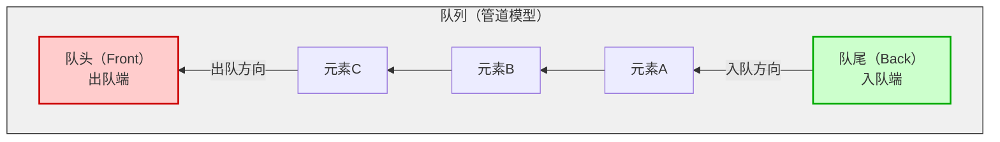

> [!important] 基本情况
> 先进先出，**不提供迭代器**，不能遍历




# 创建

$O(1)$
```cpp
queue<T> q
```


# 插入与删除

- 队尾插入元素，$O(1)$
```cpp
q.push(val); 
```

- 队首删除元素，$O(1)$
```cpp
q.pop();
```

# 获取

- 返回队首元素的引用，$O(1)$
```cpp
q.front();
```

- 返回队尾元素引用，$O(1)$
```cpp
q.back();
```

- 获取元素个数，$O(1)$
```cpp
q.size();
```

# 交换

- 交换内容，$O(1)$
```cpp
swap(q1,q2);
```

# 清空

> [!tip] Title
> 注：`queue` 没有 `clear()` ，需逐个 `pop()` 或交换空队列
