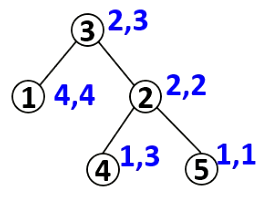
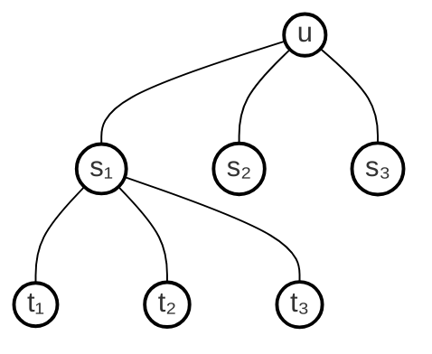

# 树上背包


前置知识：[[背包DP#分组背包 |分组背包]]  


## 问题描述

​	有 `N` 个物品和一个容量是 `v` 的背包。物品之间具有依赖关系，且依赖关系组成一棵树的形状。如果选择一个物品，则必须选择它的父节点。



**如上图所示：**

​	如果选择物品5，则必须选择物品2和3。这是因为2是5的父节点，3是2的父节点。
每件物品的编号是 `i` ,体积是 $v_i$，价值是 $w_i$,依赖的父节点编号是 $p_i$。物品的下标范围是 $1 \sim N$。
求解将哪些物品装入背包，可使物品总体积不超过背包容量，且总价值最大。输出最大价值。


## 状态变量

考虑一颗以 `u` 为根节点的子树的所有物品，这颗子树的物品的最大价值应该是节点 `u` 和和背包容量 `j` 的函数。

`f[u][j]` 表示选择以 `u` 为子树的物品，在体积和不超过容量 `j` 时所获得的最大价值。


## 分析

**如图所示：**




设节点 `u` 有 `i` 个子节点 $s_1,s_2,s_3...,s_i$，每个子节点可选或不选。

我们可以把 `u` 的 `i` 个子节点看做 `i` 组物品，每组物品 $s_i$ <font color="#6425d0">按单位体积拆分</font>，有 $0,1,2,...,j-v [u]$ 种物品（决策）可供选择，至多可选1种。

**这样的话，就可以看作是分组背包，每到一个 `u` 结点时，就会进行一次分组背包** 

**从根节点 `u` 开始 `dfs` ，从根到叶，再从叶到根回溯时，做分组背包，更新 `f` 值。**

> [!NOTE] 
> **按单位体积拆分**是因为 $s_i$ 的子孙可能存在体积为1的物品；
> **拆分到 `j-v[u]` ** 是因为要预留出 `v[u]` 的空间装入节点 `u` 的物品。


## 代码

Time：$O(N*M^2)$

```cpp
const int N = 305;
const int M = 305;
vector<int> e[N];
int n,m;
int v[u]; // 体积
int w[N]; // 价值
int fa[N],f[N][M];
void dfs(int u){
    for(int i=v[u];i<=m;i++){
        f[u][i] = w[u];
    }
    for(int s:e[u]){
        dfs(s);
        for(int j=m;j>=v[u];j--){
            for(int k=0;k<=j-v[u];k++){
                f[u][j] = max(f[u][j],f[u][j-k]+f[s][k]);
            }
        }
    }
}
```

这有个小细节，在循环子儿子的时候，实际上可以看成 分组背包中的 $1\sim N$ 的外层循环，然后状态`f[u][j]` 实际上是本压缩了一层，本质上是 `f[u][i][j]` ，也就是在 **u结点下的分组背包状态**，知道了这个可能会更容易理解代码。


## 优化代码


