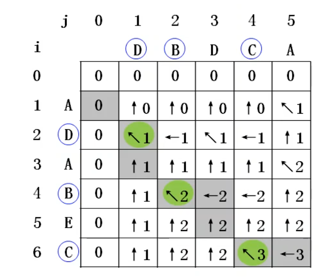

# 最长公共子序列


## 状态变量：

用 `f[i][j]` 记录序列 `a[1...i]` 和 `b[1...j]` 的最长公共子序列长度。


对于末尾元素，有 3 种情况：

1. 若`a[i]=b[j]` ，则`a[i]` 与 `b[j]` 在公共子序列中；

   `f[i][j] = f[i-1][j-1] + 1`

2. 若 `a[i]!=b[j]` ，且`a[i]` 不在公共子序列中，则可去掉 `a[i]`；

   `f[i][j] = f[i-1][j]`

3. 若 `a[i]!=b[j]` ，且`b[j]` 不在公共子序列中，则可去掉 `b[j]`；

​	`f[i][j] = f[i][j-1]`


对于`a[i]`和`b[i]` 都不在公共子序列的情况，其实就是 2和3的合并；


## **递推式：**

$$
f[i][j] = \begin{cases} f[i-1][j-1] + 1, & a[i] = b[j] \\ \max\left(f[i-1][j], f[i-1][j-1]\right), & a[i] \neq b[j] \end{cases}
$$
## **边界条件：**

$$
f[0][j] = 0 ,f[i][0] = 0
$$


## 代码

```cpp
for(int i=1;i<+n;i++){
    for(int j=1;j<=m;j++){
        if(a[i-1]==b[j-1])
            f[i][j] = f[i-1][j-1]+1;
        else 
            f[i][j] = max(f[i-1][j],f[i][j-1]);
    }
}
cout<<f[n][m];
```


如果我们要输出这个子序列的话，怎么做呢？有同学可能会想到在这里做记录，**但是是不完全对的**；

```cpp
 if(a[i-1]==b[j-1])
	f[i][j] = f[i-1][j-1]+1;
```

因为这里记录的元素并**不会真正地出现**在最终的最长上升子序列中；


## 正确的路径记录


首先，我们看最开始的代码

```cpp
for(int i=1;i<+n;i++){
    for(int j=1;j<=m;j++){
        if(a[i-1]==b[j-1])
            f[i][j] = f[i-1][j-1]+1;
        else 
            f[i][j] = max(f[i-1][j],f[i][j-1]);
    }
}
```

我们给它改一下，新建一个 `p[][]` 数组来来记录每次更新时，`f[i][j]`来自哪里，需要用二维网格的视角来看待`f[i][j]`；

如下：

```cpp
for(int i=1;i<=n;i++){
    for(int j=1;j<=m;j++){
        if(a[i-1]==b[j-1]){
		    f[i][j] = f[i-1][j-1]+1;   
	        p[i][j] = 1; // 左上
        }
        else if(f[i][j-1] > f[i-1][j]){
            f[i][j] = f[i][j-1];
            p[i][j] = 2; // 左边
        }
        else {
	        f[i][j] = f[i-1][j];   
            p[i][j] = 3; // 上边
        }
    }
}
```

**然后就会形成一幅图**





最后逆向查找和输出

```cpp
int i,j,k = f[n][m];
char s[N];
while(i>0&&j>0){
    if(p[i][j] ==1){
        s[k--] = a[i-1];
    	i--;j--;
    }
    else if(p[i][j] == 2){
        j--;
    }
    else i--;
}
for(int i=1;i<=f[n][m];i++){
    cout<<s[i];
}
```


# 最长公共子串

与最长公共子序列，有一些区别


**公共子串**：**字符必须是**连续相等**的；

**公共子序列：** 字符必须是相等的，**可以不连续**；


## 状态变量

用 `f[i][j]` 表示以 `a[i]` 和 `b[j]` 为**结尾**的公共子串的长度。


## 递推式：

1. 若 `a[i]==b[j]`，则可以构成公共子串，

   `f[i][j]=f[i-1][j-1]+1`

2. 若 `a[i]!=b[j]`，则不能构成公共子串，

   `f[i][j]=0`

## 边界条件

$$
f[0][j] = 0 ,f[i][0] = 0
$$


## 代码

```cpp
for(int i=1;i<=n;i++){
    for(int j=1;j<=m;j++){
		if(a[i] == b[j]){
            f[i][j] = f[i-1][j-1] + 1;
        }
        else f[i][j] = 0;
        mx = max(mx,f[i][j]);
    }
}
```


## 路径记录

```cpp
int end;
for(int i=1;i<=n;i++){
    for(int j=1;j<=m;j++){
		if(a[i] == b[j]){
            f[i][j] = f[i-1][j-1] + 1;
        }
        else f[i][j] = 0;
        if(mx<f[i][j]){
            mx = f[i][j];
            end = i;
        }
    }
}
for(int i=end-mx+1;i<=end;i++){
    cout<<a[i];
}
```

