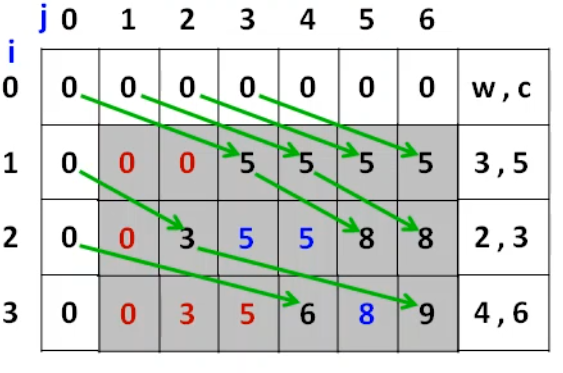
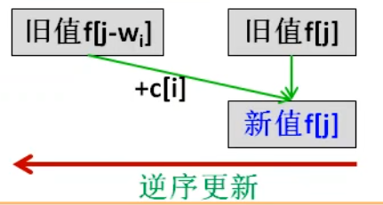
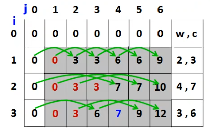
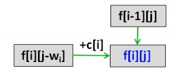

# $01$ 背包

## 问题描述：

​	有一个容量为 `m` 还有 `n` 件物品。它们的重量分别是 $w_1、w_2...w_n$ ，它们的价值分别为 $v_1、v_2...v_3$，求最大总价值


## 状态变量

 `f[i][j]` 表示 **前 `i` 件物品** 放入 **容量为 j 的背包** 的 **最大价值**。

当前背包的容量为 `j` ，我们要考虑第 `i` 件物品 **能否放入？ 是否放入？**

1. 如果当前背包容量 `j < w[i]` ，不能放入，则 `f[i][j] = f[i-1][j]` 。

2. 如果当前背包容量 `j >= w[i]` ，能放入，但需要比较代价，**比较放入与不放入**，哪个更优

   `f[i][j] = max(f[i-1][j],f[i-1][j-w[i]]+ c[i])` 。


## 状态转移方程

$$
f[i][j] = 
\begin{cases} 
f[i-1][j], & j < w[i] \\
\max\left(f[i-1][j], f[i-1][j - w[i]] + c[i]\right), & j \geq w[i]
\end{cases}
$$


## 边界条件

$$
f[i][j] = 0
$$


## 代码

**初步的：这个时候，内外层循环没有限制**；

Time $O(nm)$ ，Space $O(nm)$

```cpp
for(int i=1;i<=n;i++){
    for(int j=1;j<=m;j++){
        if(j < w[i])f[i][j] = f[i-1][j];
        else f[i][j] = max(f[i-1][j],f[i-1][j-w[i]]+c[i]);
    }
}
```


那么，我们再以网格的视角来观察：



**容易发现，对于每一行，其每个单元格的状态只与上一行的单元格有关，并且与之相关的上一行单元格的列 < 当前单元格的列**

那么，我们可以尝试把 `dp[i][j]` 简化为 `dp[j]`，这样的话，内层循环应当是逆序的，如下：

**一维的： 此时，外层循环必须是物品**；

Time $O(nm)$ ，Space $O(m)$

```cpp
for(int i=1;i<=n;i++){
    for(int j=w;j>=1;j--){ 
        if(j < w[i])f[j] = f[j];
        else f[j] = max(f[j],f[j-w[i]]+c[i]);
    }
}
```

**也就是如下的效果：**




到了这里，我们再看看，还有第二关；可以发现：`if(j < w[i])f[j] = f[j]`，说明只有当 `j>=w[i]` 时，`f[j]` 才会更新；

## 最简的

Time $O(nm)$ ，Space $O(m)$

```cpp
for(int i=1;i<=n;i++){
    for(int j=w;j>=w[i];j--){ 
        f[j] = max(f[j],f[j-w[i]]+c[i]);
    }
}
```


# 完全背包


## 问题描述：

一个容量为 `m` 公斤的背包。现有 `n` 种物品，每种物品有**无限多件**，它们的重量分别为 `Wi` （1≤i≤n），它们的价值分别为`Ci`(1≤i≤n)。求能放入背包的最大价值。


## 状态变量

 `f[i][j]` 表示 **前 `i` 件物品** 放入 **容量为 j 的背包** 的 **最大价值**。

当前背包的容量为 `j` ，我们要考虑第 `i` 件物品 **能否放入？ 是否放入？**

1. 如果当前背包容量 `j < w[i]` ，不能放入，则 `f[i][j] = f[i-1][j]` 。

2. 如果当前背包容量 `j >= w[i]` ，能放入，但需要比较代价，**比较放入与不放入**，哪个更优

   - 若第 `i` 件物品不放入背包，则 `f[i][j] = f[i-1][j]`；

   - 若第 `i` 件物品放入背包，则 `f[i][j] = f[i][j-w[i]] + c[i]`；

     对于前 `i` 件物品，背包容量为 `j-w[i]` 时可能已经放入了第 `i` 件物品，

     容量为 `j` 时还可以再放入第 `i` 件物品，所以用 `f[i][j-w[i]]` 更新 `f[i][j]`；

     `f[i][j] = max(f[i-1][j],f[i][j-w[i]]+ c[i])` 。


## 状态转移方程

$$
f[i][j] = 
\begin{cases} 
f[i-1][j], & j < w[i] \\
\max\left(f[i-1][j], f[i][j - w[i]] + c[i]\right), & j \geq w[i]
\end{cases}
$$


## 边界条件

$$
f[i][j] = 0
$$


## 代码

在代码上，其实与 01背包差别不大，我们一个一个来看吧，从最基础的，到最终的。


**基础的**

```cpp
for(int i=1;i<=n;i++){
    for(int j=1;j<=m;j++){
        if(j < w[i])f[i][j] = f[i-1][j];
        else f[i][j] = max(f[i-1][j],f[i][j-w[i]]+c[i]);
    }
}
```


然后我们看图，如下：



对于每一个单元格，本质上如下图所示：



那么我们还是可以降维的，与01背包不同的是：**完全背包需要从前往后，也就是正序**。

```cpp
for(int i=1;i<=n;i++){
    for(int j=1;j<=m;j++){
        if(j < w[i])f[j] = f[j];
        else f[j] = max(f[j],f[j-w[i]]+c[i]);
    }
}
```


同样的，省去 $ if(j < w[i])f[j] = f[j]$，得到最简化的版本。

## 最简的

Time $O(nm)$ ，Space $O(m)$

```cpp
for(int i=1;i<=n;i++){
    for(int j=w[i];j<=m;j++){
        f[j] = max(f[j],f[j-w[i]]+c[i]);
    }
}
```


# 多重背包

有 `n` 种物品和一个容量为 `m` 的背包。第 `i` 种物品最多有 $s_i$ 件，每件体积是 $v_i$ ，价值是 $w_i$ 。求解选择哪些物品放入背包，使物品体积总和不超过背包容量，且价值总和最大。


## 朴素做法

- 01背包：第 `i` 种物品可以取0件、取1件。
- 多重背包：第 `i` 种物品可以取0件、取1件、取2件…取 $s_i$ 件。
- 多重背包转化为01背包求解：把第 `i` 种物品换成 $s_i$ 件01背包中的物品，每件物品的体积为 $k*w_i$ ,价值为 $k*c_i$  (0≤k≤S1)。


对01背包改造一下，如下：

Time：$O(m\sum_i s_i)$

```cpp
for(int i=1;i<=n;i++){
    for(int j=m;i>=w[i];j--){
        for(int k=0;k<=s[i]&&k*w[i]<=j;k++){
            f[j] = max(f[j],f[j-k*w[i]]+k*c[i]);
        }
    }
}
```


## 二进制优化


### 苹果与箱子的例子

假设有 50 个苹果，现在要取 n 个苹果（n≤50），如何取？朴素的做法应该是将苹果一个一个拿出来，直到 n 个苹果被取出来。

再假设有 50 个苹果和 6 只箱子，利用箱子进行某些预备工作，可以在每个箱子中放2k（k≥0）个苹果，也就是 1、2、4、8、16、19（剩余的数），取任意 n 个苹果时，只要推出几只箱子就可以了。


### 二进制拆分思想

将第 i 种物品拆分成若干件物品，每件物品的体积和价值乘以一个拆分系数$(1,2^1,2^2⋯2^k−1,s_i−2^k+1)$，就可以转化成 01 背包的物品求解。

例如，$s_i=12$，拆分系数为 1, 2, 4, 5，转化成 4 件 01 背包的物品：

$(v_i,w_i),(2v_i,2w_i),(4v_i,4w_i),(5v_i,5w_i)$


### 代码

Time ：$O(m\sum_ilogs_i) =  O(mlog(\prod_i si))$ 

```cpp
int num = 0;
int n;
int vv[N];
for(int i=1,s,c,w;i<=n;i++){
   	cin>>w>>c>>s;
    for(int i=1;i<=s;i<<1){
        ww[++num] = i*w; // 存体积
        cc[num] = i*c; // 存价值
        s -= i;
    }
    if(s){
        ww[++num] = s*w;
        cc[num] = i*c;
    }
}

for(int i=1;i<=num;i++){
    for(int j=m;j>=ww[i];j--){
        f[j] = max(f[j],f[j-ww[i]] + cc[i]);
    }
}
```


## 单调队列优化

**懒得写了，直接看代码吧，后面再补 --------------------------------------------------------------------2026.1.30**


Time ：$O(nm)$

```cpp
const int N = 1e5+5;
int f[N],g[N],q[N];

for(int i=1,num,v,w;i<=n;i++){
    cin>>num>>v>>w;// 数量 体积 价值
    memcpy(g,f,sizeof(f));
    for(int j=0;j<v;j++){
        int l=0,r=-1;
        for(int k=j;k<=m;k+=v){
            if(l<=r && q[l]<k-num*v)l++;
            if(l<=r) f[k] = max(g[k],g[q[l]]+(k-q[l])/v*w);
            while(l<=r && g[k] >= g[q[r]]+(k-q[r])/v*w)r--;
            g[++r] = k;
        }
    }
}
```


# 分组背包


**前置知识：[[背包DP#$01$ 背包 |01背包]]**


## 问题描述

有 `n` 组物品和一个容量是 `v` 的背包。每组物品有若干个，同一组内的物品**最多只能选一个**，每件物品的体积是 $v_{ij}$ ，价值是 $w_{ij}$ ，

其中 `i` 是组号，`j` 是组内编号。求解将哪些物品放入背包，可使物品总体积不超过背包容量，且总价值最大，输出最大价值。


**本质上其实还是01背包，转移方程，边界都略过**


朴素算法应该是循环物品组，循环背包容量，

对第 i 组物品，容量为 j 的背包，有 s+1 种选法：

$Max(f[i-1][j], f[i-1][j-v₁]+w₁, f[i-1][j-v₂]+w₂, ..., f[i-1][j-vₛ]+wₛ)$


## 状态变量

​	最大价值应该是物品组 `i` 和背包容量 `j` 的函数，用 `f[i][j]` 表示前 `i` 组物品，能放入容量为 `j` 的背包的最大价值。


## 代码

k = 0 的时候就是不选任何一个第 `i` 组的物品

- 二维实现

```cpp
for(int i=1;i<=n;i++){	// 物品
    for(int j=1;j<=m;j++){	//体积
        for(int k=0;k<=s[i];k++){	//决策
            if(j>=v[i][k]){
                f[i][j] = max(f[i][j],f[i-1][j-v[i][k]] + w[i][k]);
			}
        }
    }
}
```


- 一维实现

```cpp
for(int i=1;i<=n;i++){	//物品
    cin>>s;
    for(int i=1;i<=s;i++)cin>>v[i]>>w[j];
    for(int j=m;j>=1;i--){	//体积
        for(int k=0;k<=s;k++){	//决策
            if(j>=v[k]){
                f[j] = max(f[j],f[j-v[k]] + w[k]);
			}
        }
    }
}
```


**注意：体积和决策不能互换**


