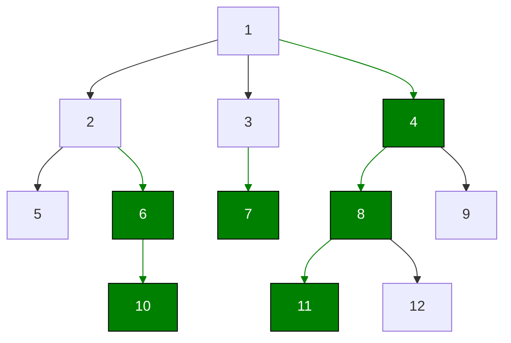

# 树链剖分

## 新定义：

**重儿子**：父节点的所有儿子中， **子树节点数目最多的节点**

**轻儿子：** 父结点中除重儿子以外的儿子

重边：父结点和重儿子连成的边

轻边：父结点和轻儿子连成的边

**重链：** 由多条 **重边连接** 而成的路径

1. 整棵树会被剖分成若干条重链。
2. 轻儿子一定是每条重链的顶点。
3. 任意一条路径被切分成不超过logm条链。

**注意：** 在树链剖分中，若一个节点的多个子树节点数（子树大小）相同且均为最大值，**可以任意选择其中一个作为重儿子**。

**绿色为重链**



## 实现步骤

### 1、变量定义

```cpp
#include <iostream>
using namespace std;
vector<int> e[N];// 图
int fa[N]; // 存 u 的父节点
int dep[N]; // 存 u 的深度
int son[N]; //存 u 的重儿子
int sz[N]; //存以 u 为根的子树的节点数
int top[N]; //存 u 所在重链的顶点
```

**整体流程：**

1. 第一遍 $dfs$ ，求出 `fa`、`dep`、`son`、`sz`
2. 第二遍 $dfs$，搞出 `top` 数组
3. 让两个游标沿着各自的重链向上跳，跳到同一条重链上，深度较小的那个游标所指向的点，就是LCA

### 2、核心实现

```cpp
void dfs1(int u,int fath){
    fa[u] = fath;dep[u] = dep[fath]+1;sz[u]=1;
    for(int v;e[u]){
		if(v==fath)continue;
        dfs(v,u);
        sz[u]+=sz[v];
        if(sz[son[u]]<sz[v])son[u]=v;
    }   
}
void dfs2(int u,int t){
    top[u]=t;
    if(!son[u])return ;// 没有重儿子则返回
    dfs2(son[u],t); // 搜重儿子
    for(int v,e[u]){
        if(v==fa[u]||v==son[u])continue;
     	dfs2(v,v); // 搜轻儿子
	}
}
```


相关的用法：
1. [[传统算法/图论/最近公共祖先/树链剖分|树链剖分求LCA]]
2. 