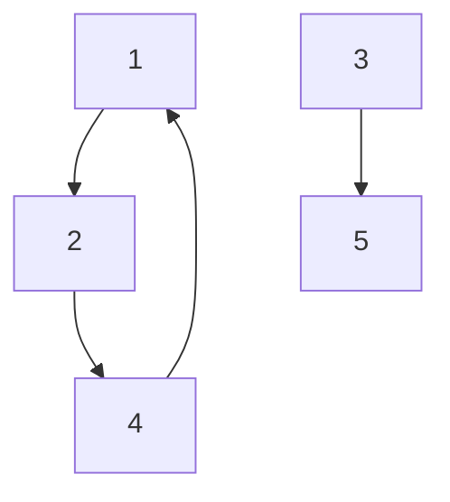
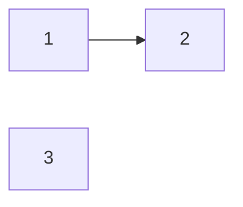
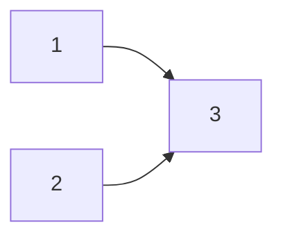
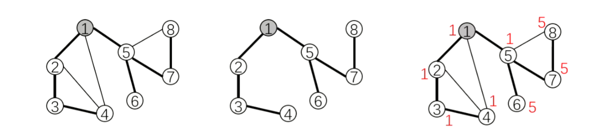

# 强连通分量

先简单回顾一下，**强连通分量（Strongly Connected Components，SCC）的定义是：极大的强连通子图。**

在这里我们将会介绍一个算法，用来求一个图中的 **强连通分量**。

求强连通分量指的是什么呢？**求得一个图的各个节点所属的强连通分量，以及强连通分量的个数**。


# Tarjan 强连通分量 算法


> [!info] 
> 有向图


> [!quote] 
> Robert E. Tarjan（罗伯特·塔扬，1948~），生于美国加州波莫纳，计算机科学家。
> Tarjan 发明了很多算法和数据结构。不少他发明的算法都以他的名字命名，以至于有时会让人混淆几种不同的算法。
> 比如求各种连通分量的 Tarjan 算法，求 LCA（Lowest Common Ancestor，最近公共祖先）的 Tarjan 算法。并查集、Splay、Toptree 也是 Tarjan 发明的。

我们这里要介绍的是在**有向图中求强连通分量的 Tarjan 算法。**

## 前置


对图深搜时，每一个节点只访问一次，被访问过的节点与边构成 **搜索树**。

有向边按访问情况分 4 类：

1. 树边：访问节点走过的边。图中黑色边。
2. <font color="#ff0000">返祖边</font>：指向祖先节点的边。图中的红色边。
3. <font color="#00b050">横叉边</font>：指向子树中节点的边。图中的绿色边。
4. <font color="#00b0f0">前向边</font>：指向子树中节点的边。图中的蓝色边。

**返祖边与树边必成环，横叉边可能与树边构成环**。前向边无用。


## 过程

- **时间戳** `dfn[x]`：节点 `x` 第一次被访问的顺序。

- **追溯值** `low[x]`：从节点 `x` 出发，所能访问的最早时间戳。


1. <font color="#ff0000">入</font> x 时，盖戳、入栈。

2. 枚举 `x` 的邻点 `y` ，分三种情况。

   - 若 `y` **未访问**：对 `y` 深搜。<font color="#ff0000">回 </font>`x` 时，用 `low[y]` 更新 `low[x]`。

     因为 `x` 是 `y` 的父节点，`y` 能访问到的点，`x` 一定也能访问到。

   - 若 `y` **已访问且在栈中**：说明 `y` 是 祖先节点 或 左子树节点，

     用 `dfn[y]` 更新 `low[x]`。

   - 若 `y` **已访问且不在栈中**：说明 `y` 已搜索完毕，

     其所在连通分量已被处理，所以不用对其做操作。

3.<font color="#ff0000"> 离 </font>`x` 时，记录 SCC 。只有遍历完一个 SCC ，才可以出栈。

​	更新 `low` 值的意义：<font color="#ff0000">避免 SCC 的节点提前出栈。</font>


## 代码示例

```c++
const int N = 1e4 + 5;
vector<int> e[N];
int dfn[N],low[N];
int stk[N],instk[N];
int scc[N],siz[N];
int n,m,tot,cnt,tp;
void tarjan(int u){
    // 入 u 时，盖戳，入栈
    dfn[u] = low[u] = ++tot;
    stk[++tp] =  u, instk[u] = 1;
    for(int v:e[u]){
        if(!dfn[v]){ // 若 v 尚未访问 
            tarjan(v);
            low[u] = min(low[u],low[v]); // 回 u 时更新 low
        }
        else if(instk[v]){ // 若 v 已访问且在栈中
            low[u] = min(low[u],dfn[v]); // 更新 low
            // 这里也可以是low[u] = min(low[u],low[v])
            // 但为了与tarjan割点统一写法，就写为low[u] = min(low[u],dfn[v])
        }
    }
    // 离 u 时 ，记录scc
    if(dfn[u] == low[u]){ // 若 u 是 scc 的根
        int y;++cnt;
        do{
            y = stk[tp--],instk[y] = 0; 
            scc[y] = cnt; // scc编号 
            siz[cnt] ++;  // scc大小
        }while(y!=u);
    }
}
int main(){
    cin>>n>>m;
    for(int i=1;i<=m;i++){
        int a,b;cin>>a>>b;
        e[a].push_back(b);
    }
    for (int i = 1; i <= n; i++) {
        if (!dfn[i]) {  
            tarjan(i);
        }
    }
    return 0;
}
```


# Tarjan SCC 缩点

我们通过上述算法可求得整个图的强连通分量。额外地，我们再说一下**缩点**的东西，**缩点**是基于找到强连通分量后的一个另外的操作，就是我们可以**把图上的各个强连通分量看作为点**。

如图所示：



很显然，节点 1，2，4组成一个强连通分量，3为一个强连通分量，5为一个强连通分量。

那么就可以把 1，2，4看成一个新的点，3看成一个新的点，5看成一个新的点，进而解决对应的问题。

**这就是 SCC 缩点的思想** 


## 代码示例 

这样的写法，可以明确每一个强连通分量的**入度和出度**

```cpp
for(int x=1;x<=n;x++){
    for(int y:e[x]){
        if(scc[y]!=scc[x]){
            din[scc[y]]++; // 根据需求可以替换成 e[scc[x]].push(scc[y])
            dout[scc[x]]++;
        }
    }
}
```


> [!tip] 
>在一个**有向图**中，进行强连通分量**缩点后**，得到的新图一定是一个**有向无环图（DAG）** 



或者



# Tarjan 割点

> [!info] 
> 无向图


粗边连成的结点构成一颗搜索树



先介绍一下什么是割点：

​	**割点：** 对于一个**无向图**，如果把一个点删除后，连通块的个数增加了，那么这个点就是割点（又称割顶）

**割点判定法则：**

​	如果 `x` 不是根节点，当搜索树上存在 `x` 的一个子节点 `y` ，满足 $low[y]>=dfn[x]$ ，则 `x` 为割点

​	如果 `x` 是根节点，当搜索树上至少存在 两个子节点 `y1`，`y2` ，满足 $low[y]>=dfn[x]$，则 `x` 为割点


> [!info] 
 这里的根节点指的就是搜索的起始顶点


​	$low[y]≥dfn[x]$，说明从y出发，在不通过 `x` 点的前提下，不管走哪条边，都无法到达比 `x` 更早访问的节点。

故删除 `x` 点后，以 `y` 为根的子树 $subtree(y)$ 也就断开了。即**环顶的点割得掉**。

​	反之，若 $low[y]<df[x]$，则说明 `y` 能绕行其他边到达比 `x` 更早访问的节点，`x` 就不是割点了。即**环内的点割不掉**。


## 代码示例

```cpp
#include <iostream>
#include <vector>
using namespace std;
const int N = 1e5+5;
vector<int> e[N];
int low[N],dfn[N];
int tot,root,cut[N];
void tarjan(int u){
    // 入 u 时，盖时间戳
    dfn[u] = low[u] = ++tot;
    int chd = 0;
    for(int v:e[u]){ 
        if(!dfn[v]){ // 若 v 尚未访问
            tarjan(v);
            // 回 u 时，更新 low，判割点
            low[u] = min(low[u],low[v]);
            if(low[v] >= dfn[u]){
                chd++;// 子树个数
                if(u!=root || chd >= 2){
                    cut[u] = 1;  
                }
            }
        }
        else { // 若 v 已经访问
            low[u] = min(low[u],dfn[v]); // 这里必须是low[u] = min(low[u],dfn[v]);
        }
    }
}
int main(){

    return 0;
}
```


## 代码分析

我们再来分析一下代码吧，这个和 **Tarjan 强连通** 长得有点类似，但是维护的状态不一样

```cpp
if(!dfn[v]){
    tarjan(v);
    low[u] = min(low[u],low[v]);
    if(low[v] >= dfn[u]){
        chd++;
        if(u!=root || chd >= 2){
            cut[u] = 1;  
		}
	}
}
```

这段代码，就是说如果这个顶点没有被访问过，那么就继续 `tarjan(v)` ，然后在用 $low[v]$ 更新一下 $low[u]$ 。

那么，既然 `v` 之前没有被访问过，那么必然是 `u` 的子树结点。结合刚才所说的 **割点判定**，我们才会在代码中写到 $if(low[v] >= dfn[u])$ 的判断。


而后，为什么 `else` 这里只是更新 $low[u]$ 而没有判断呢？ 

```cpp
else {
	low[u] = min(low[u],dfn[v]);.
}
```

我们仔细想想，既然是执行 `else` 语句，那么我们可以知道 `dfn[v] == 1`，说明这个 `v` 结点在 `u` 访问它之前就已经被访问过了，进而说明，`v` 不能算作为 `u` 的子树，所以没有进行  $if(low[v] >= dfn[u])$ 的判断


## 另外的

在tarjan强连通分量中，有如下2种写法 

```cpp
else { 
    low[u] = min(low[u],low[v]);
}
else {
    low[u] = min(low[u],dfn[v]);
} 
```

而在tarjan 割点中，却只有一种写法 

```cpp
else {
    low[u] = min(low[u],dfn[v]);
}
```

这是为什么呢，需要我们思考。

**等后面在写原因吧，现在有点累了，不想敲字了   ————————————2026/1/15 19:35** 


# Tarjan 割边

> [!info] 
> 无向图


先介绍一下什么是割边：

​	**割边：** 对于一个**无向图**，如果把一条边删除后，连通块的个数增加了，则称这条边为**桥**或者**割边**；

**割边判定法则：**

​	当搜索树上存在 `x` 的一个子节点 `y`  ， 满足 $low[y]>dfn[x]$ ,则 `(x，y)` 这条边就是割边。

​	$low[y]>dfn[x]$ ，说明从 `y` 出发，在不经过  `(x,y)`  这条边的前提下，不管走哪条边，都无法到达 `x` 或更早访问的节点。故删除 `(x,y)` 这条边以 `y` 为根的子树 $subtree(y)$ 也就断开了。**即环外的边割得断**。

​	反之，若 $low[y]<=dfn[x]$ ，则说明 `y` 能绕行其他边到达 `x` 或更早访问的节点，`(x,y)` 就不是割边了。**即环内的边割不断**。


**注意：**

- 割点判定：$low[y]>=dfn[x]$

  允许走 `(x,y)` 的反边更新 $low$ 值；

- 割边判定：$low[y]>dfn[x]$

​	不允许走 `(x,y)` 的反边更新 $low$ 值；


## 代码示例

因为涉及到反边的判断，所以需要用序号来标记边，这样的话，就需要用链式邻接表或者链式前向星

此处用的链式邻接表；

```cpp
#include <iostream>
#include <vector>
using namespace std;
const int N =1e5+5;
const int M =1e5+5;
struct edge{int u,v;};
vector<int> h[N];
vector<edge> e;
struct bridge{int u,v;}bri[M];
int low[N],dfn[N],tot,cnt;
void add(int u,int v){
    e.push_back({u,v});
    h[u].push_back(e.size()-1);
}

void tarjan(int u,int v_edge){
    dfn[u] = low[u] = ++tot;
    for(int i=0;i<h[u].size();i++){
        int id = h[u][i],v = e[id].v;
        if(!dfn[v]){
            tarjan(v,id);
            low[u] = min(low[u],low[v]);
            if(low[v] > dfn[u]){
                bri[++cnt] = {u,v};
            }  
        }
        else if(id != (v_edge^1)){
            low[u] = min(low[u],dfn[v]);
        }
    }
}


int main(){

    return 0;
}
```


