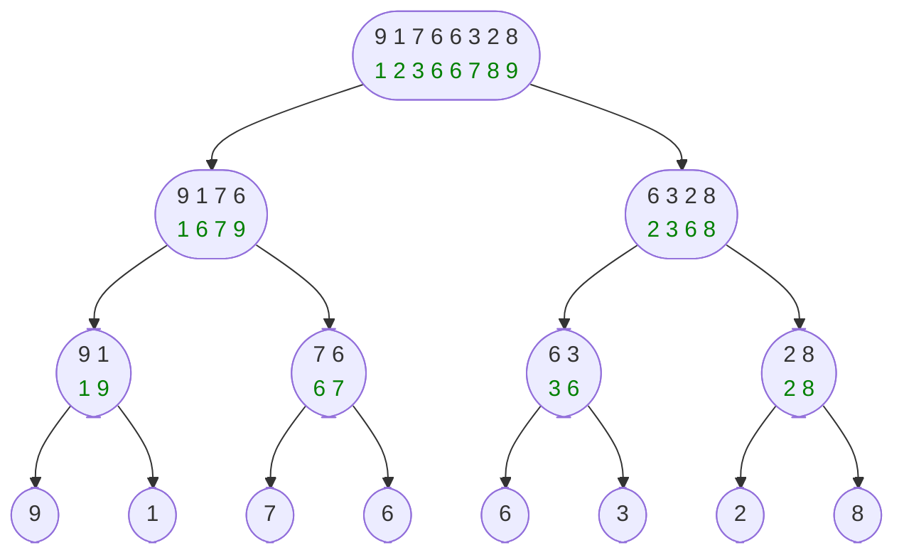

# 归并排序$(nlog(n))$

## 核心：

​	主要利用分治思想，时间复杂度$(nlog(n))$

1. **对数列不断等长拆分，直到只有一个数的长度**
2. **回溯时，按升序合并左右两段**
3. **重复以上过程，直到递归结束**


**黑色为原始状态，绿色为回溯后排序好的状态**





## 代码展示

```cpp
#include <iostream>
using namespace std;
const int N = 1e5 + 5;
int n,a[N],b[N];
// a[]为原数组,b为过渡数组
void msort(){
    if(l == r)return;
    int mid = (l+r)>>1;
    msort(l,mid);
    msort(mid+r);
    // i 表示a的左段起点, j 表示a的右段起点
    // k 表示b的起点
    int i=1,j=mid+1,k=l;
    while(i<=mid&&j<=r){
        if(a[i]<=a[j]) b[k++]=a[i++];
        else b[k++]=a[j++];
    }
    while(i<=mid) b[k++]=a[i++];
    while(j<=r) b[k++]=a[j++];
    // 更新a数组
    for(i=l;i<=r;i++) a[i]=b[i];
}


```


## 解释：

1. **$i,j$ 分别指向 $a$ 的左右段起点，$k$ 指向b的起点。**
2. **枚举 $a$ 数组，把左数放入 $b$ 数组，否则，把右数放入 $b$ 数组。**
3. **把左段或右段剩余的数放入 $b$ 数组。**
4. **把 $b$ 数组的当前段复制回 $a$ 数组**


## 对比

|        |   快速排序   |   归并排序   |
| :----: | :----------: | :----------: |
|  分治  | 先交换后拆分 | 先拆分后合并 |
| 稳定性 |    不稳定    |     稳定     |


## 对于逆序对

在解决逆序对个数问题时，需要对原模版进行一点点改动

```cpp
#include <iostream>
using namespace std;
const int N = 1e5 + 5;
int n,a[N],b[N];
long long res = 0;
void msort(){
    if(l == r)return;
    int mid = (l+r)>>1;
    msort(l,mid);
    msort(mid+r);
    
    int i=1,j=mid+1,k=1;
    while(i<=mid&&j<=r){
        if(a[i]<=a[j]) b[k++]=a[k++];
        else b[k++]=a[j++],res += mid-i+1;
    }
    while(i<=mid) b[k++]=a[i++];
    while(j<=r) b[k++]=a[j++];
    for(i=1;i<=r;i++) a[i]=b[i];
}
```

