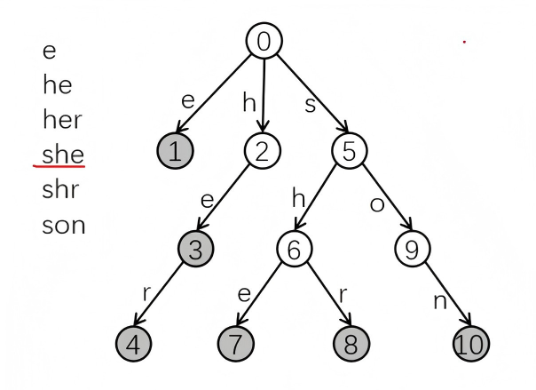

## AC自动机

**一种多模式匹配算法**。给定 $n$ 个模式串和一个主串，查找多少个模式串在主串中出现过


💡**AC自动机 = Trie + KMP**

AC自动机在 **Trie** 树上添加 **fail 指针**，该指针和 **KMP** 中的 **fail 指针** 功能类似

> 若还未了解，请点击以下链接
>
> [KMP]: KMP算法.md
> [Trie树]: 字典树.md


**步骤**：

1. **构造Trie树**

   我们先用 $n$ 个模式串构造一颗 $Trie$

   $Trie$ 中的一个 **节点** 表示一个从根到当前节点的 **字符串**

   根节点表示空串，节点 ⑤ 表示 “s” ，节点 ⑥ 表示 “sh”，节点 ⑦ 表示“she”。

    如果节点是个模式串，则打个标记。例如，$cnt[7] = 1$。

2. **构造AC自动机**

   在 $Trie$ 上构建两类边：**回跳边** 和 **转移边**

3. **扫描主串匹配**





## 构造Trie树

```c++
int ch[N][26],cnt[N],idx;
int ne[N];
int 
void insert(char *s){ //建树
    int p = 0;
    for(int i=0;s[i];i++){
        int j=s[i]-'a';
        if(!ch[p][j])ch[p][j]=++idx;
        p=ch[p][j];
    }
    cnt[p]++:
}
```


## 构造AC自动机

**用BFS构造AC自动机**

初始化把根节点的儿子们入队。

只要队不空，节点 $u$ 出队，

枚举 $u$ 的 $26$ 个 儿子，

1. 若 **儿子存在**，则爹帮儿子建 **回跳边**，并把儿子入队。
2. 若 **儿子不存在** ，则爹自建 **转移边**


`ne[v]`  存节点 $v$ 的 **回跳边**的终点。

**回跳边**指向**父节点的回跳边所指节点的儿子**

四个点 `( v，u，ne[u]，ch[][] )`构成四边形。

回跳边所指节点一定是当前节点的最长后缀。


若`ch[u][i]` 为空。则  `ch[u][i]` 叮存节点 $u$ 的转移边的终点。

**转移边**指向**当前节点的回跳边所指节点的儿子。**

三个点`( u, ne[u], ch[][] )`构成三角形

转移边所指节点一定是当前节点的最短路。


### CODE $O(26n)$

$n$ 为模式串总长度

```C++
void build(){
    queue<int> q;
    for(int i=0;i<26;i++)
    	if(ch[0][i])q.push(ch[0][i]);
    
    while(q.size()){
        int u=q.front();q.pop();
        for(int i=0;i<26;i++){
            int v=ch[u][i];
            if(v)ne[v]=ch[ne[u]][i],q.push(v);
            else ch[u][i]=ch[ne[u]][i];
        }
    }
}
```


## 查找单词出现次数

扫描主串，依次取出字符sk],

1. **ⅰ**指针走主串对应的节点，沿着**树边**或**转移边**走

   保证不回退

2.  **j** 指针沿着**回跳边**搜索模式串，每次从当前节点

   走到根节点，把当前节点中的所有后缀模式串

   一网打尽，保证不漏解。

3. 扫描完主串，返回答案。

   算法一边走串，一边把当前串的所有后缀串搜出来，实在是强。

> 真是天雷滚滚，秒不可言啊！


### CODE

#### 版本1 $O(m+n)$

m 为主串长度，n 为模式串的总长度

这个查询版本是**查询主串中出现了几种模式串**

比如：

- 主串为 `abcdcd`

- 模式串为 `ab`、`cd`、`ac`

那么 `query()` 返回的结果为 2，出现的模式串为 `ab`、`cd`

```c++
int query(char *s){
    int ans=0;
    for(int k=0,i=0;s[k];k++){
        i = ch[i][s[k]-'a'];
        for(int j=i;j&&~cnt[j];j=ne[j])
            ans+=cnt[j],cnt[j]=-1;// 这里将会清除标记,这样的话~cnt[j]=0
    }
    return ans;
}
```


## 区别

|            |          KMP           |              AC自动机              |
| :--------: | :--------------------: | :--------------------------------: |
|    匹配    |   **单模式**匹配算法   |         **多模式**匹配算法         |
|    形态    |     链上构造自动机     |         Trie树上构造自动机         |
|  数据维护  |         回跳边         | 回跳边 ne[]，树边，转移边 `ch[][]` |
|  算法流程  | 双指针建边，双指针匹配 |        BFS建边，双指针匹配         |
| 时间复杂度 |         O(n+m)         |              O(26n+m)              |

