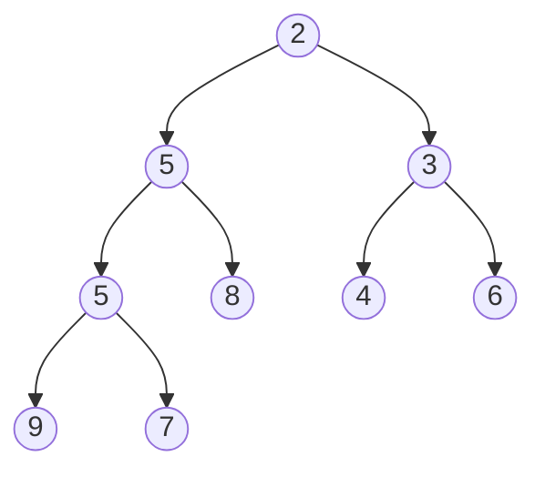
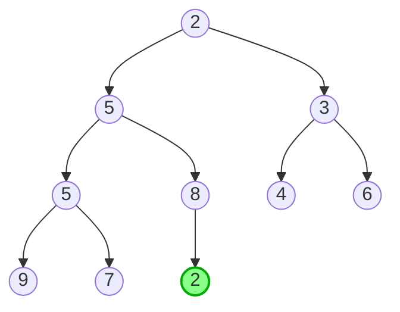
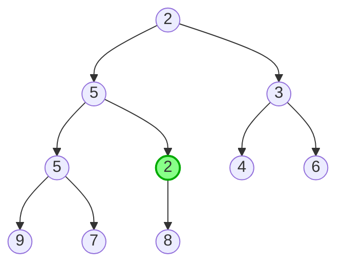
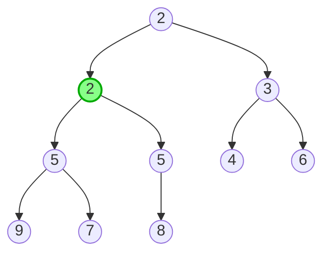
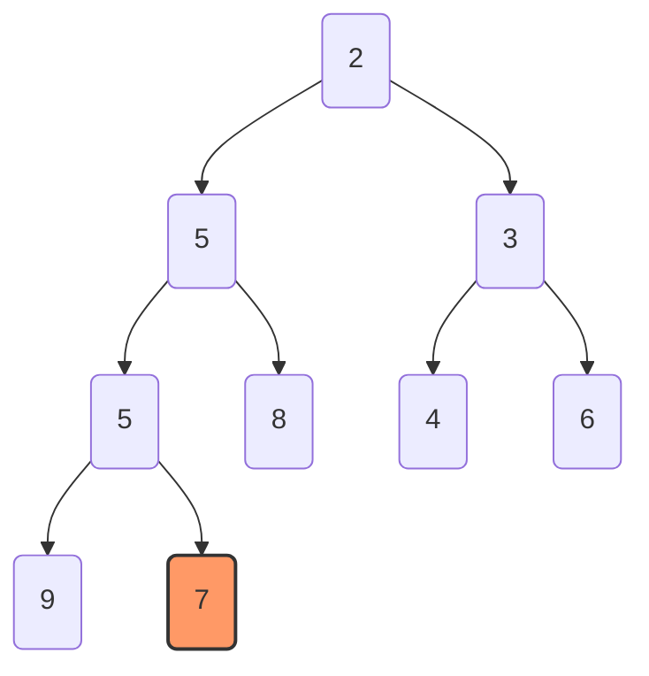
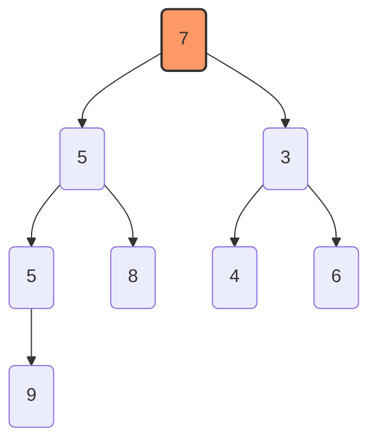
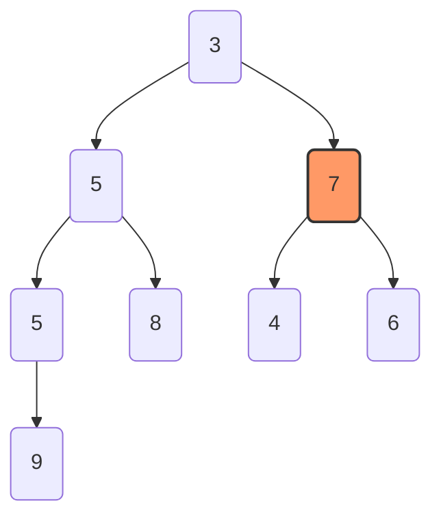
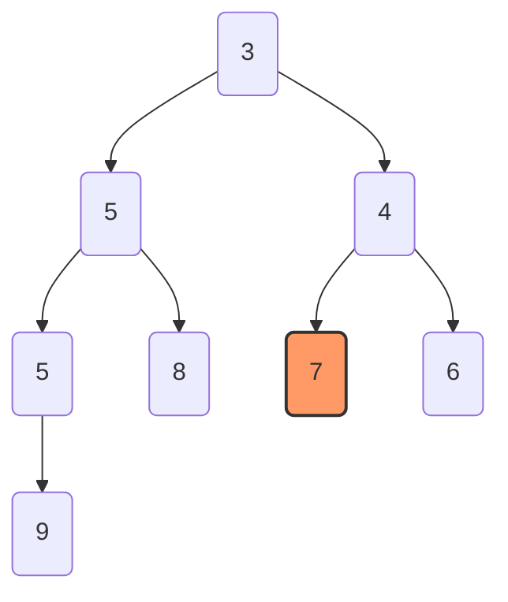

## 堆

### 1.定义

**堆**是一棵**完全二叉树**

堆分为两类：

- **大根堆：**父节点的值 $\leq $ 其子节点的值
- **大根堆：**父节点的值 $\ge$ 其子节点的值

这也是**优先队列**的运行方式


**以小根堆为例子：**



对节点使用**左右孩子编号法**：

1. 节点 $i$ 的左孩子是 $2i$
2. 节点 $i$ 的右孩子是 $2i+1$
3. 节点 $i$ 的父节点是 $i/2$ （向下取整特性） 


### 2.存储方式

**堆**可以用**一维数组**存储

<table style="border-collapse: collapse; margin: 1em 0;">   <tr>     <!-- 第1列 -->     <td style="border: 1px solid #000; width: 35px; text-align: center;">       <div>2</div>       <sub style="color: blue;">1</sub>     </td>     <!-- 第2列 -->     <td style="border: 1px solid #000; width: 35px; text-align: center;">       <div>5</div>       <sub style="color: blue;">2</sub>     </td>     <!-- 第3列 -->     <td style="border: 1px solid #000; width: 35px; text-align: center;">       <div>3</div>       <sub style="color: blue;">3</sub>     </td>     <!-- 第4列 -->     <td style="border: 1px solid #000; width: 35px; text-align: center;">       <div>5</div>       <sub style="color: blue;">4</sub>     </td>     <!-- 第5列 -->     <td style="border: 1px solid #000; width: 35px; text-align: center;">       <div>8</div>       <sub style="color: blue;">5</sub>     </td>     <!-- 第6列 -->     <td style="border: 1px solid #000; width: 35px; text-align: center;">       <div>4</div>       <sub style="color: blue;">6</sub>     </td>     <!-- 第7列 -->     <td style="border: 1px solid #000; width: 35px; text-align: center;">       <div>6</div>       <sub style="color: blue;">7</sub>     </td>     <!-- 第8列 -->     <td style="border: 1px solid #000; width: 35px; text-align: center;">       <div>9</div>       <sub style="color: blue;">8</sub>     </td>     <!-- 第9列 -->     <td style="border: 1px solid #000; width: 35px; text-align: center;">       <div>7</div>       <sub style="color: blue;">9</sub>     </td>     <!-- 第10列（空内容） -->     <td style="border: 1px solid #000; width: 35px; text-align: center;">       <div></div>       <sub style="color: blue;">10</sub>     </td>   </tr> </table>

> 蓝色为下标


### 3.操作方式

#### ①堆的插入

**方法：**把新元素从堆尾插入，再逐层**上浮**到合适位置

**时间复杂度：**$O(logn)$










#### $CODE\;O(logn)$

```c++
int heap[1000010],cnt;
//以递归形式呈现
void up(int u){// 上浮
    if(u/2&&heap[u/2]>heap[u]){
        swap(heap[u],heap[u/2]);
        up(u/2);
    }
}
void push(int x){// 压入
    heap[++cnt]=x;
    up(cnt);
}
```


#### ②堆的删除

**方法：**把尾元素移动到根上，再逐层**下沉**到合适位置

**时间复杂度：**$O(logn)$












#### $CODE\;O(logn)$

```C++
void down(int u){
    int v=u;
    if(u*2<=cnt&&heap[u*2]<heap[v])v=u*2;
    if(u*2+1<=cnt&&heap[u*2+1]<heap[v])v=u*2+1;
    if(u!=v)swap(a[u],a[v]),down(v);
}
void pop(){
    a[1]=a[cnt--];
    down(1);
}
```


## RES CODE

```C++
int heap[1000010],cnt;
//以递归形式呈现
void up(int u){// 上浮
    if(u/2&&heap[u/2]>heap[u]){
        swap(heap[u],heap[u/2]);
        up(u/2);
    }
}
void push(int x){// 压入
    heap[++cnt]=x;
    up(cnt);
}
void down(int u){// 下沉
    int v=u;
    if(u*2<=cnt&&heap[u*2]<heap[v])v=u*2;
    if(u*2+1<=cnt&&heap[u*2+1]<heap[v])v=u*2+1;
    if(u!=v)swap(a[u],a[v]),down(v);
}
void pop(){// 弹出
    a[1]=a[cnt--];
    down(1);
}
int main(){
    /*
    操作部分略
    n次操作的复杂度：O(nlogn)
    */
}
```


## STL

在C++的内置库中有  <**queue**> 可以直接使用

```C++
#include <iostream>
#include <queue>
using namespace std;

// 默认是大顶堆（最大元素优先）
priority_queue<int> maxHeap;
// 小顶堆（最小元素优先）
priority_queue<int, vector<int>, greater<int>> minHeap;

int main(){
    
    return 0;
}
```

 